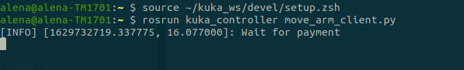

# Control Kuka manipulator with robonomics.
Video with an example of work can be found [here](https://youtu.be/fYJVF7KrNnI)
***

## Requirements
* ROS melodic, Gazebo (installation instraction [here](http://wiki.ros.org/melodic/Installation/Ubuntu))
* Some extra packages
```bash
sudo apt-get install ros-melodic-gazebo-ros-control ros-melodic-effort-controllers ros-melodic-joint-state-controller
```
* IPFS 0.4.22 (download from [here](https://www.npackd.org/p/ipfs/0.4.22) and install)
```bash
tar -xvzf go-ipfs_v0.4.22_linux-386.tar.gz
cd go-ipfs/
sudo bash install.sh
ipfs init
```
* ipfshttpclient
```bash
pip3 install ipfshttpclient
```
* substrate-interface
```bash
pip3 install substrate-interface
```
***
## Installation
Install Kuka manipulator and control packages
```bash
cd catkin_wc/src/
git clone https://github.com/orsalmon/kuka_manipulator_gazebo
https://github.com/tubleronchik/neon-kuka-demo.git
cd ..
catkin_make
```
***

## Configuration

Make scripts executable:
```
cd catkin_wc/src/neon-kuka-demo
chmod +x liability/send_liability.js
chmod +x liability/liability_finalization.js
```
Copy config template: 
```
cp config/config_template config/config
```
And add there accounts credentials.
## Running gazebo model
```bash
source ~/catkin_ws/devel/setup.bash
roslaunch manipulator_gazebo manipulator_empty_world.launch
```
In a new window
```bash
source ~/catkin_ws/devel/setup.bash
rosrun manipulator_gazebo move_arm_server
```

***
## Running ipfs
Run ipfs daemon:
```bash
ipfs daemon
```
***
## Running control package

Now you can run control script:
```bash
source ~/catkin_ws/devel/setup.bash
rosrun neon-kuka-demo move_arm_client.py
```



